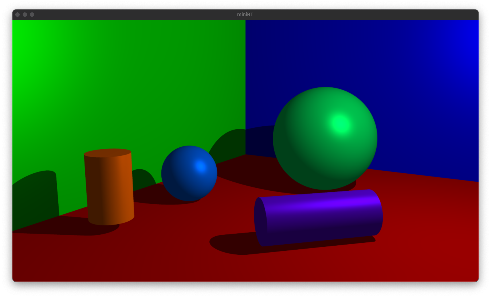

# miniRT
### My first RayTracer with miniLibX
   

## Summary
#### This project is an introduction to the beautiful world of Raytracing. Once completed you will be able to render simple Computer-Generated-Images and you will never be afraid of implementing mathematical formulas again.
   

## Install
	$ make [-jN] (all)
   

## Usage
	$ ./miniRT /path_to_scene/your_scene.rt
* File must end with `.rt` extension
* Scene file has 6 elements:
	* Ambient light:
		* `A ratio [color]`
	* Camera
		* `C position direction fov`
	* Light
		* `L position ratio [color]`
	* Sphere
		* `sp position diameter color`
	* Plane
		* `pl position orientation color`
	* Cylinder
		* `cy position orientation diameter height color`
	* Element in capital letters are mandatory
   

### Result
* Mandatory(scene01.rt)

* Bonus(scene02.rt)
