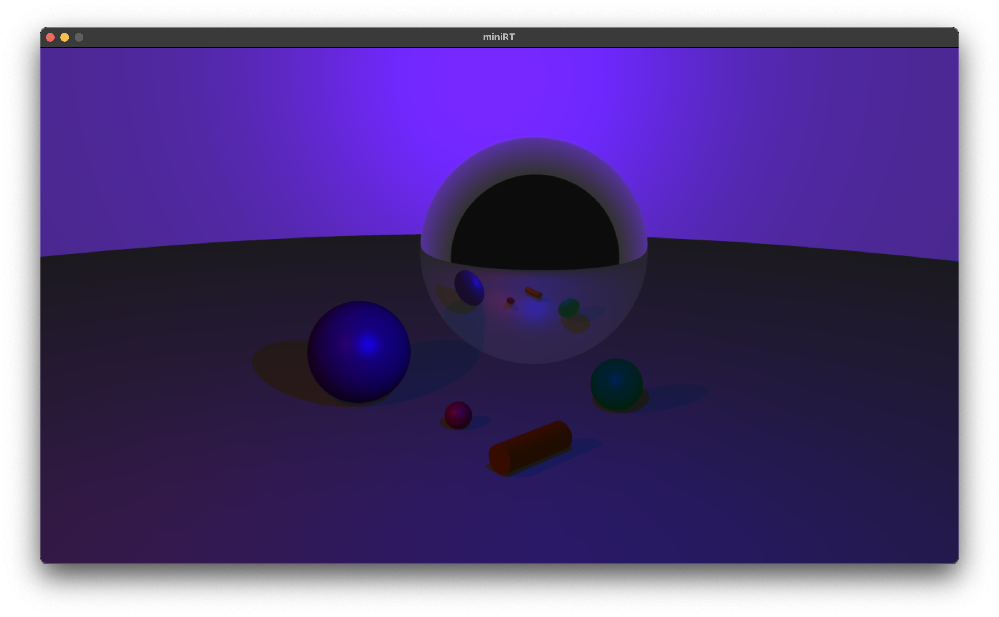

# miniRT
### My first RayTracer with miniLibX
   

## Summary
#### This project is an introduction to the beautiful world of Raytracing. Once completed you will be able to render simple Computer-Generated-Images and you will never be afraid of implementing mathematical formulas again.
   

## Install
### Mandatory part
	$ make [-jN] (all)
### Bonus part
	$ make [-jN] bonus

   

## Usage
	$ ./miniRT /path_to_scene/your_scene.rt
#### To use elements supported in bonus part, you must compile with `make bonus`
* File must end with `.rt` extension
* Scene file supports 7 elements:
	* Ambient light:
		* `A ratio [color](bonus)`
	* Camera
		* `C position orientation fov`
	* Light
		* `L position ratio [color](bonus)`
	* Sphere
		* `sp position diameter color`
	* Plane
		* `pl position normal color`
	* Cylinder
		* `cy position axis diameter height color`
	* Cone (bonus)
		* `co position axis diameter height color`
* Elements in capital letters are mandatory and those must not be duplicated
* Multiple, colored lights are supported in bonus part
* Textures of objects below are supported in bonus part
	* LAMBERTIAN
	* DIELECTRIC
   

## Result
### Mandatory (scene01.rt)
	$ ./minirt scene/scene01.rt

### Bonus (scene02.rt)
	$ ./minirt scene/scene02.rt
